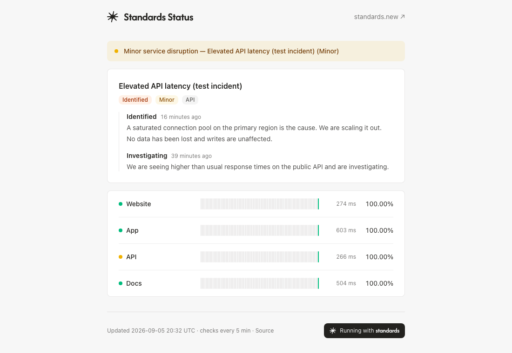

# Standards Status

An open-source status page. Services, incidents and check history live in a [Standards](https://standards.new) workspace; this app pings, stores and renders.

The app is MIT. It depends on the `@stndrds/client` SDK, which is licensed under the Standards SDK License, and on a Standards workspace.



## Deploy in four steps

1. **Fork** this repository.
2. **Create an API key** in Standards. Its role must grant `architect:update` (used once by the schema sync) and read/write access to records.
3. **Deploy to Vercel** with the button below and fill in `STANDARDS_API_URL`, `STANDARDS_API_KEY` and `CRON_SECRET`. The button also links a Blob store, which injects `BLOB_READ_WRITE_TOKEN` for the offline fallback.

   [](https://vercel.com/new/clone?repository-url=https://github.com/andyoucreate/standards-status&env=STANDARDS_API_URL,STANDARDS_API_KEY,CRON_SECRET&stores=%5B%7B%22type%22%3A%22blob%22%7D%5D)

4. **Sync the schema** once from your machine, with the same variables in `.env.local`, then add services in the Standards UI:

   ```sh
   pnpm schema:sync
   ```

   The script pushes the five objects (`services`, `checks`, `daily-stats`, `incidents`, `incident-updates`) and their list views. It exits `0` when the source is applied or already up to date, `1` on a name conflict, a rejected definition or a refused key.

## How it works

```
Vercel Cron (*/5)  ──▶  GET /api/check ──▶ ping services ──▶ write checks + daily-stats
                                        ├─▶ build snapshot ──▶ saveSnapshot() (Vercel Blob)
                                        └─▶ revalidateTag("status")

Visitor ──▶ CDN (ISR) ──▶ page "/" ──▶ loadStatus() ["use cache"] ──▶ Standards
                                                    └─ on failure ──▶ loadLastSnapshot() (Vercel Blob)
```

- **Cron.** Every 5 minutes (Vercel Pro), `GET /api/check` authenticates with `CRON_SECRET`, fetches the enabled services and pings them in parallel with a 10 s timeout. Each result becomes a `checks` record.
- **Aggregation.** The same run upserts one `daily-stats` record per service and UTC day: `total`, `failed`, `responded` (checks that got an HTTP response) and a running `avgLatencyMs` over the responded ones. The 90-day bars and uptime percentages are computed from these records only.
- **Retention.** Raw `checks` older than 7 days are purged, at most 100 per run (the API's page cap).
- **Cache.** The page reads a `'use cache'` view with a 60 s lifetime and the `status` cache tag. The cron revalidates that tag after every run, so a fresh check or an incident edited in Standards shows within a minute while visitors are served from the CDN and never hit Standards.
- **Offline.** When Standards is unreachable, the page serves the last snapshot saved to Vercel Blob by the cron, marked with the time it was taken. Without a snapshot it renders an explicit "Status data temporarily unavailable" state, still with HTTP 200. Without `BLOB_READ_WRITE_TOKEN` (self-hosting), the snapshot store is a no-op and only the live path applies.

## Reporting an incident

Everything happens in the Standards UI:

1. Create an `incidents` record: title, `status` (`investigating`, `identified`, `monitoring`), `impact` (`none`, `minor`, `major`, `critical`), `startedAt`, and link the affected `services`. The banner takes the label and color of the strongest open impact, and each linked service inherits it.
2. Add `incident-updates` records as you progress: a status, a markdown message and `postedAt`. They are shown newest first on the incident card.
3. Set `status` to `resolved` and fill `resolvedAt` to close it. The incident then moves to the collapsed past-incidents list for 14 days.

## Local development

```sh
pnpm install
cp .env.example .env.local   # fill STANDARDS_API_URL, STANDARDS_API_KEY, CRON_SECRET
pnpm dev
```

`pnpm build` prerenders the home page, so it needs the same three variables. Without a
reachable Standards API it builds the "unavailable" state, which is what CI does.

Trigger a check by hand (with `CRON_SECRET=dev` in `.env.local`):

```sh
curl -s -H "Authorization: Bearer dev" http://localhost:3000/api/check
```

`pnpm lint`, `pnpm typecheck` and `pnpm test` are the gates run in CI on every pull request.

## Good first issues

- Email / RSS subscriptions to incidents.
- A per-incident page with the full update timeline.
- A per-service filter on the public page.
- A shared cache for self-hosting (Upstash or similar) instead of per-instance memory.
- i18n: the page is in English only.

## License

MIT. See [LICENSE](LICENSE).
